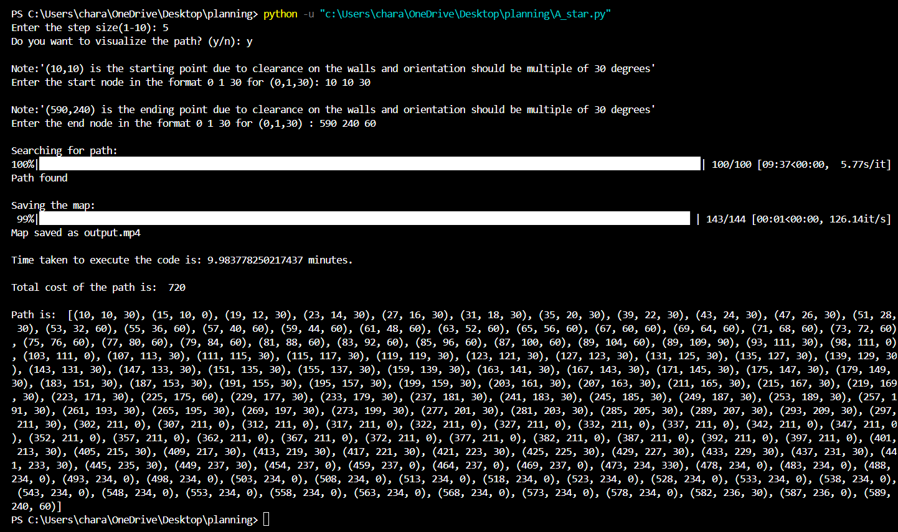

# Path-Planning-of-mobile-robot-using-A-star-Algorithm

## ENPM661: Planning for Autonomous Robots

## Project Members
- Venkata Sai Sricharan Kasturi - UID: 119444788
- Datta Lohith Gannavarapu - UID: 119455395

## Contents of the repository 
1. A_star.py
2. Terminal-Output.png
3. output.mp4
4. output.gif
5. README.md

## Dependencies
- python 3.11.1
- Visual studio code

## Libraries
- import numpy as np
- import time
- import cv2 as cv
- import heapq
- from tqdm import tqdm
- import math

## How to run the code
1. Download the zip file and extract it
2. Install Python 3.11.1 and the libraries mentinoned above, prior to running the code
3. Open your IDE
5. Execute the code 

## Results
Video output is generated showing the explored nodes and the optimal path calculated using A* Algorithm

### Terminal output: 

